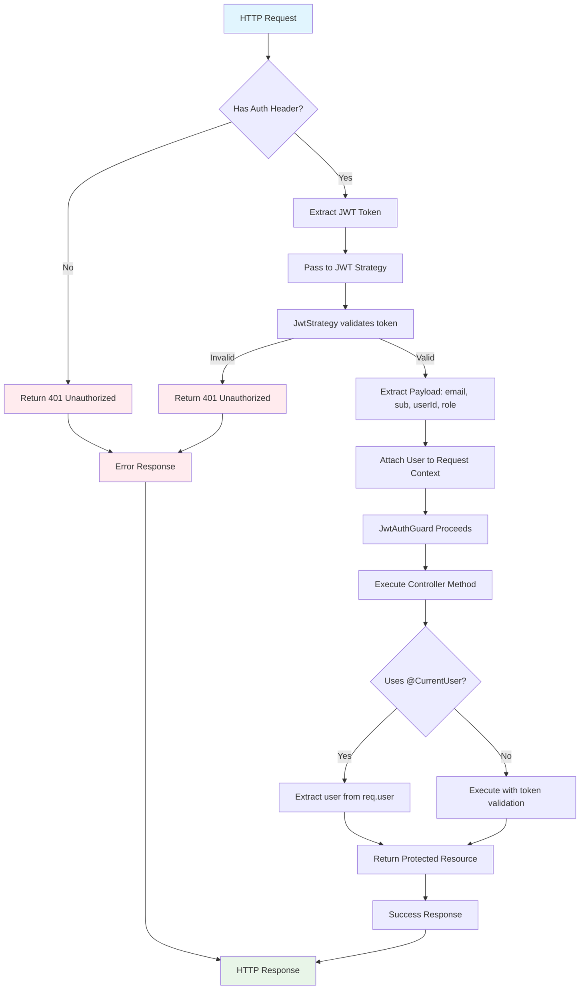

# DMS Authentication Flow

## System Overview
This document outlines the authentication flow for the DMS (Document Management System) backend.

## Flowchart



## Component Breakdown

### 1. Auth Flow Process
```
Request → JWT Guard → JWT Strategy → Validate Token → Attach User → Controller → Response
```

### 2. Components & Responsibilities

| Component | File | Responsibility |
|-----------|------|----------------|
| **JWT Guard** | `jwt-auth.guard.ts` | Intercepts requests, applies JWT strategy |
| **JWT Strategy** | `jwt.strategy.ts` | Validates JWT token, extracts user info |
| **Auth Controller** | `auth.controller.ts` | Handles login/register endpoints |
| **Auth Service** | `auth.service.ts` | Core auth logic, password validation |
| **DTOs** | `login.dto.ts` | Input validation for login requests |
| **Custom Decorator** | `current-user.decorator.ts` | Extracts authenticated user from request |

### 3. Data Flow for Login Request

1. **User sends credentials**
   - Email & password via POST to `/auth/login`

2. **Validation with DTO**
   - `LoginDto` validates email format and required fields

3. **Service processes request**
   - Finds account by email
   - Compares hashed password using bcrypt
   - Updates last_login timestamp

4. **JWT Token Generation**
   - Creates access and refresh tokens
   - Includes user info in payload

5. **Response returned**
   - Returns token and user info in standardized format

### 4. Data Flow for Authenticated Request

1. **Request includes token**
   - `Authorization: Bearer <token>` header

2. **JWT Guard activates**
   - Extracts token from header
   - Passes to JWT Strategy

3. **Token validated**
   - JWT Strategy verifies token signature
   - Extracts user information from payload

4. **User attached to context**
   - `req.user` populated with user data
   - Guard allows request to proceed

5. **Controller execution**
   - Uses `@CurrentUser()` to access user data
   - Executes protected business logic

### 5. Key Benefits

- **Separation of Concerns**: Each component has a specific role
- **Reusability**: JWT Guard can protect any endpoint
- **Security**: Password hashing, token validation
- **Type Safety**: DTOs provide input validation
- **Clean Controllers**: Decorators abstract auth details

### 6. Security Considerations

- Passwords are hashed using bcrypt
- JWT tokens have expiration times
- Invalid tokens return 401 Unauthorized
- All sensitive data is filtered from responses